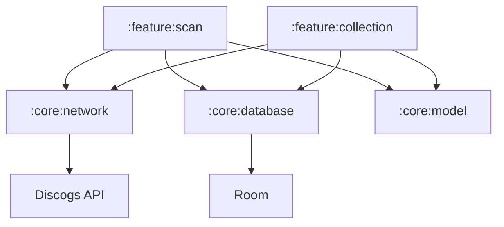
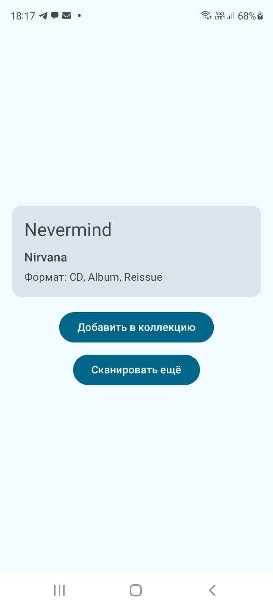

# CdVinylCatalog

Приложение-каталогизатор для личной коллекции CD, DVD, винила и аудиокассет.
Сканируйте штрихкод с диска — приложение найдёт релиз в базе Discogs
и проверит, есть ли он уже в вашей коллекции.

## Проблема

У меня имеется коллекция физических дисков и пластинок, но я не помню,
что именно у меня есть. Бывали случаи, когда я покупал диск в магазине,
а дома обнаруживал, что такой уже есть.

## Решение

1. Сканируете штрихкод с интересующего диска через камеру
2. Приложение ищет релиз в Discogs API
3. Показывает информацию: исполнитель, альбом, год, формат
4. Проверяет, есть ли уже этот диск в вашей коллекции

## Технологии

- **Kotlin** + **Coroutines** + **Flow**
- **Jetpack Compose** — UI
- **MVI** — архитектурный паттерн
- **Hilt** — dependency injection
- **Retrofit** + **OkHttp** + **Gson** — сеть
- **Room** — локальная база (в разработке)
- **CameraX** + **ML Kit** — сканирование (в разработке)
- **Discogs API** — источник данных о релизах

## Архитектура

Проект построен на **фиче-ориентированной многомодульной архитектуре**
с элементами **Clean Architecture**.

### Модули

```text
:app                    — точка входа, DI, навигация
:core:model             — доменные модели (Release, Track, Format)
:core:network           — Retrofit, Discogs API, мапперы
:core:database          — Room (в разработке)
:core:ui                — общие Compose-компоненты, тема
:feature:scan           — экран сканирования (MVI)
:feature:collection     — экран коллекции (в разработке)
```

### Схема зависимостей


Фичи зависят от core-модулей, но **не знают друг о друге**.

### MVI в :feature:scan

- **State** — единый источник правды для UI
- **Intent** — действия пользователя
- **Effect** — одноразовые события (Toast, навигация)

## Скриншоты



## Что дальше

- [ ] Интеграция CameraX + ML Kit для сканирования
- [ ] Room для локальной коллекции
- [ ] Экран коллекции с поиском
- [ ] Навигация между экранами
- [ ] Вынос строк в `strings.xml`

## Как запустить

1. Клонируйте репозиторий
2. Получите токен Discogs: [discogs.com/settings/developers](https://www.discogs.com/settings/developers)
3. Добавьте токен в `local.properties`:
   DISCOGS_TOKEN=ваш_токен

4. Соберите проект в Android Studio

## Лицензия

MIT